# CLICK & READ 📚

## Descripción 📄

CLICK AND READ es un e-commerce de libros, donde cada usuario tendra la posibilidad tanto de comprar como vender libros ya sean nuevos o usados.

---

## Tecnologías implementadas 💻

- HTML-CSS
- SASS
- JavaScript
- React
- Redux Toolkit
- Node
- Express
- Mongo - Mongoose

---

## Funcionalidades ✔

- Crear una cuenta mediante correo tradicional o acceso mediante cuenta de Google.
- Notificación por e-mail para verificar cuenta y recuperación de contraseña.
- Ver libros en venta, ver detalle de libros y buscar libros por nombre.
- Ordenar y filtrar libros mediante distintos criterios.
- Poner libros en venta, poder editar, precio cantidad e incluso añadir un descuento.
- Poder agregar libros a una lista de deseos y carrito de compras.
- Pasarela de pagos.
- Posibilidad de comprar una tarjeta de regalo y darsela a otro ususario el cuál recibe una notificación por e-mail.
- Editar información personal (nombre, correo), ver compras, añadir puntuación y comentarios a los libros.
- Panel de administrador para ver estadisticas del comercio, eliminar libros en venta, censurar usuarios y cambiar estado de los pedidos.
- Mapa con la ubicación de las tiendas físicas.

---

## Previews 📷

 

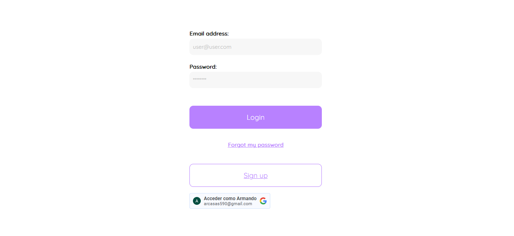
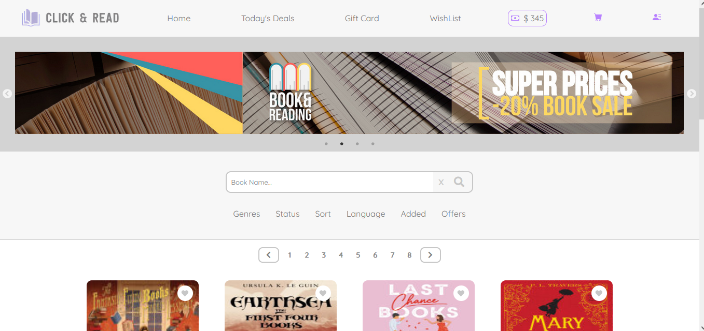
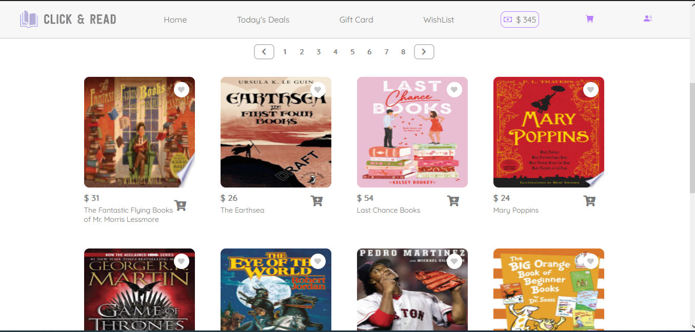
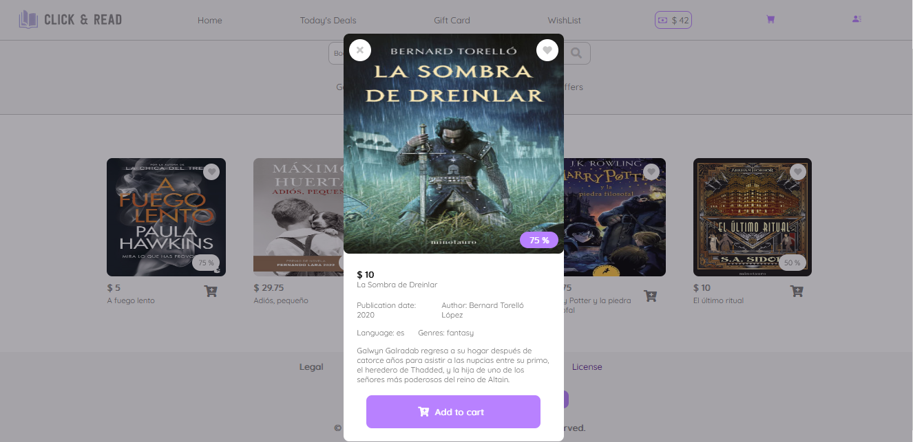

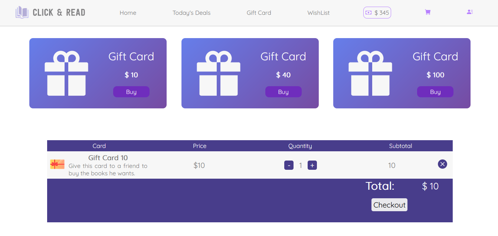
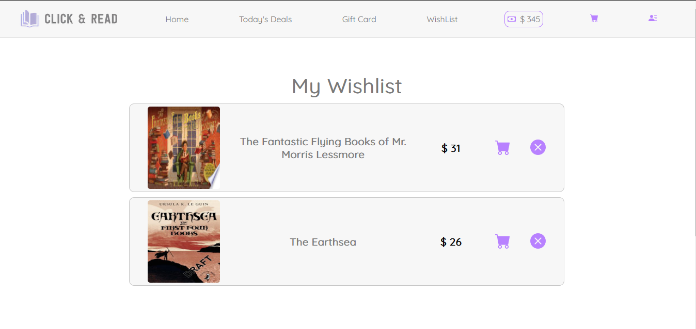
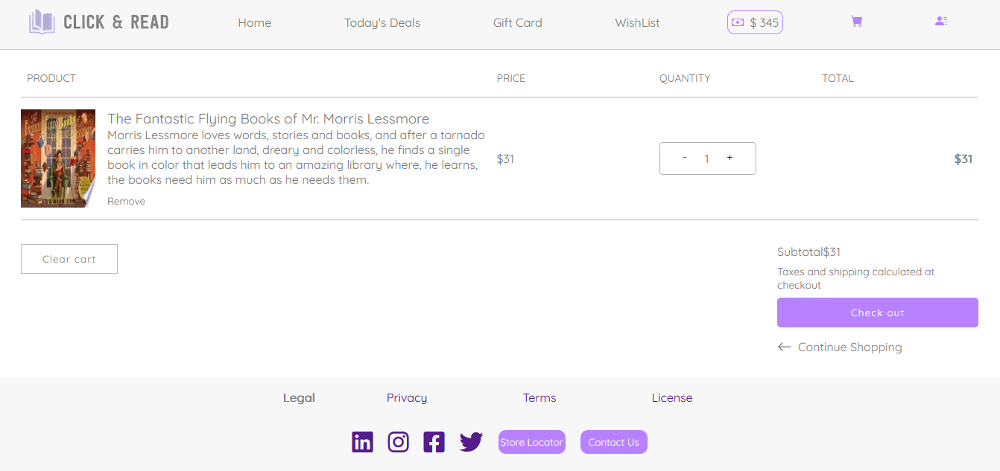
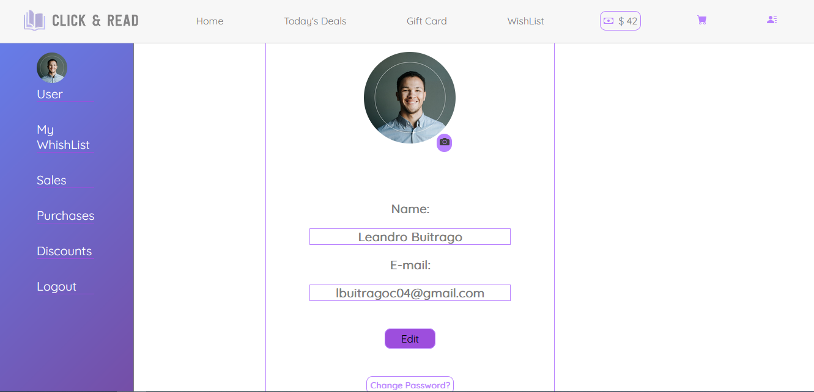
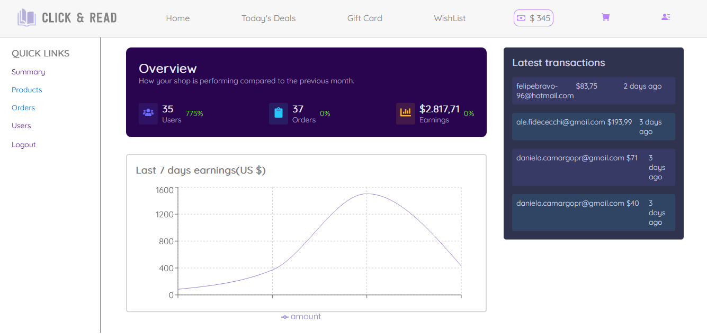
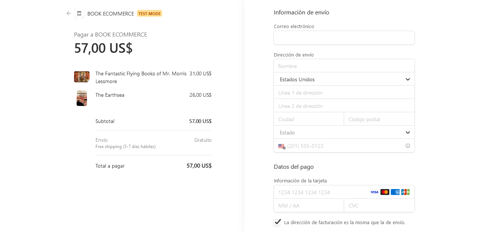
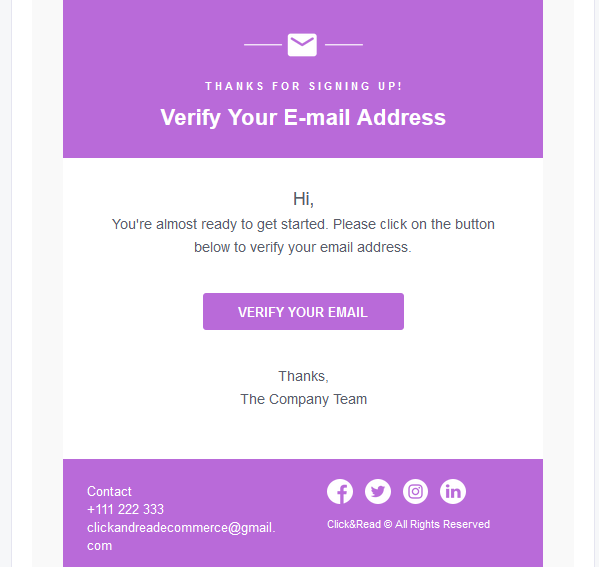

---
## Deploy 

https://ecommerce-lac-nu.vercel.app/

---
## Contribuidores 🧩

* [Felipe Bravo](https://github.com/Felipebravo-96)
* [Daniela Camargo](https://github.com/Danicp19)
* [Danny Hermoso](https://github.com/dannyhermoso)
* [Diego Carcausto](https://github.com/krqui)
* [Alejandro Fidececchi](https://github.com/alefidececchi)
* [Samir Antonio José](https://github.com/mihue14)
